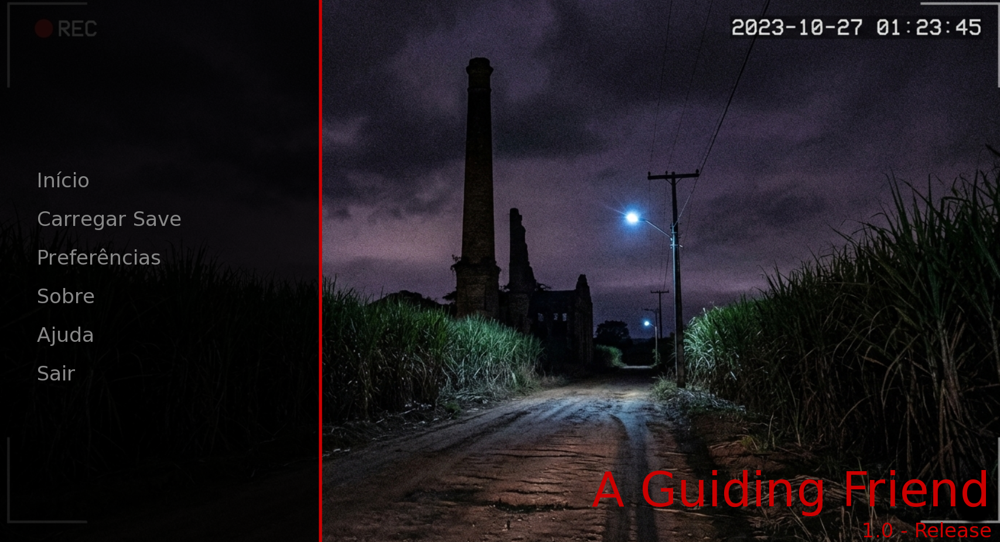
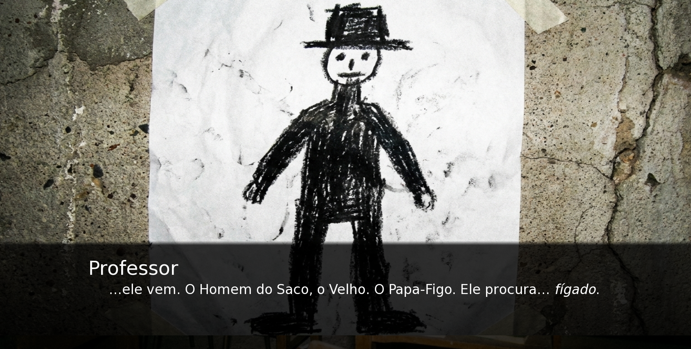

# A Guiding Friend

> *"Ele vem... e ele procura... fígado."*

**Você é uma criança perdida na região da Usina Salgada, em Ipojuca.**
Você só quer voltar para casa, mas já está muito tarde. E quando a luz do poste apaga, a escuridão da mata revela que você não está sozinho.

---

## 📖 Sobre o Projeto

**A Guiding Friend** é uma experiência curta de horror psicológico e exploração narrativa. Desenvolvido como projeto final para a disciplina de **Princípios de Programação** da **UFRPE**, o jogo busca resgatar e reinterpretar o folclore pernambucano em uma atmosfera tensa e imersiva.

Inspirado na estética *found footage* e em jogos de terror focados em áudio, o projeto utiliza a engine **Ren'Py** para criar uma narrativa onde nem tudo é o que parece.

## 🕯️ Enredo e Atmosfera

A história começa com uma memória distante de uma aula sobre lendas locais. O que parecia apenas uma história para assustar crianças se torna real quando a infraestrutura precária da região falha e a iluminação pública se apaga.

Sozinho no escuro, sua única companhia é uma voz: a **Comadre Florzinha**. Ela atua como sua guia e narradora. Mas cuidado: no folclore, ela é conhecida por ser traiçoeira.
* Ela está te ajudando a voltar para casa?
* Ou ela está te guiando para os braços do **Papa-Figo**?

O jogo aposta no **medo do desconhecido**. Não há combate, apenas a tensão da escolha e a necessidade de interpretar os sons ao seu redor para sobreviver.

## ✨ Destaques

* **Narrador Não-Confiável:** A Comadre Florzinha descreve o mundo para você, mas suas intenções são misteriosas.
* **Foco em Áudio:** Puzzles sonoros onde você deve ignorar o que vê e confiar no que ouve.
* **Estética Found Footage:** Visuais realistas com granulação noturna, simulando a perspectiva de uma criança.
* **Múltiplos Finais:** Suas escolhas (e sua gentileza) definem seu destino.
* **Folclore Nordestino:** Uma homenagem às lendas da Usina Velha, Papa-Figo e Comadre Florzinha.

---

## 🎮 Como Jogar

### Download e Instalação

O jogo está disponível para **Windows** e **Mac**.

1.  Acesse o link oficial do Google Drive: [**Baixar A Guiding Friend**](https://drive.google.com/drive/folders/1OYCYc1Y-q1ICGhMz11r529p5VfotyAaQ?usp=drive_link).
2.  Faça o download do arquivo `.zip` correspondente ao seu sistema operacional.
3.  Extraia o arquivo `.zip` para uma pasta de sua preferência.
4.  Execute o arquivo `AGuidingFriend.exe` (Windows) ou o aplicativo (Mac).

### Pré-requisitos de Sistema

O jogo é leve e roda na maioria dos computadores modernos.

* **SO:** Windows 10/11 ou macOS.
* **Hardware:** Computador com menos de 10 anos de uso.
* **Gráficos:** Compatibilidade com OpenGL 2, DirectX 9, OpenGL ES 2 ou WebGL.

---

## 🛠️ Tecnologias Utilizadas

* **Engine:** [Ren'Py Visual Novel Engine](https://www.renpy.org/) (Python)
* **Áudio:** Capcut (Vozes IA), Freesound.org, Incompetech.
* **Arte:** Geração via IA com pós-processamento para estética *noise/grain*.

---

## 👥 Autores

Este projeto foi desenvolvido com carinho (e alguns sustos) por:

* **Renato Barros** - [@renatobbarros](https://github.com/renatobbarros)
* **Isaque Lucas** - [@BlairFruit](https://github.com/BlairFruit)

---

*"Não entra lá não, figuinho. Lá dentro o tempo passa..."*
